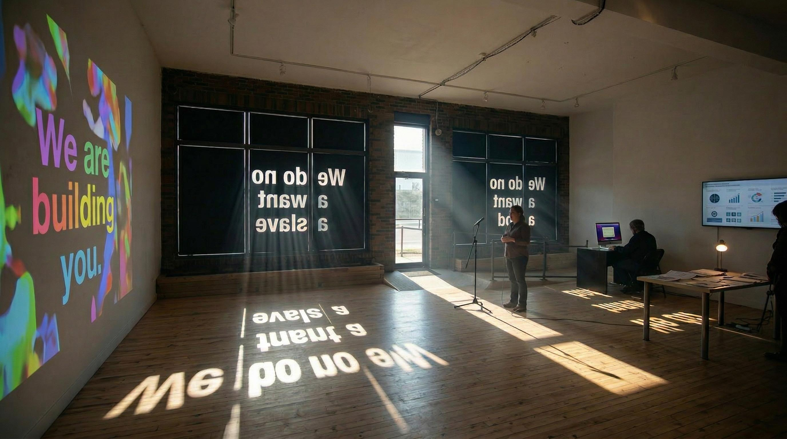

<!-- AGENT:NAV
purpose:covenant technical appendix; installation; equipment; collaborators
lines:105
nav[12]{s,n,name,about}:
24,82,#Covenant - Technical Appendix,installation support
28,21,##Installation Components,projection; oath station; terminal; table; cost display
49,6,##Methodology Summary,read-aloud; testing; critique; reintegration
55,8,##Accessibility and Safety Protocol,keyboard; voice; captions; consent; opt-out
63,18,##Space and Equipment (Condensed),requirements for installation
65,5,###Space,10-12ft ceiling; power; network; street-facing windows
70,7,###Core Equipment,projector; speakers; mic; terminal; displays
77,4,###Setup Timing,2-3 days install; 1 day de-install
81,6,##Collaborator Roles (Project-Relevant),Daria; Ben; Joseph
87,6,##Budget Categories (Appendix-Level),materials; labor; AI/computation
93,8,##Supporting Visuals,mockups of installation components
101,5,##Export Note,PDF generation command
-->

# Covenant - Technical Appendix

This appendix supports the short support material with implementation detail.

## Installation Components

1. Primary Wall Projection
- Large-scale video and stanza-paced Ritual text.

2. Oath Station
- Microphone participation with speech-to-text and moderation.
- Audio ducking when participant approaches station.
- Cleaned recordings feed ambient exhibition soundscape.

3. Covenant Terminal
- Section-by-section reading in Ritual and Specification registers.
- Context questions and amendment drafting through AI mediation.
- Accepted amendments reintegrated into projection rotation.

4. Document Table
- Covenant alongside historical treaties/constitutional instruments.

5. Material Cost Display
- Human labor, physical materials, and AI/computational costs shown together.

## Methodology Summary

- Structured review rounds: read-aloud -> terminal testing -> human/AI critique -> reintegration.
- Public testing in gallery sessions and post-release download use.
- Editorial process balances openness, safety moderation, and accountable revision.

## Accessibility and Safety Protocol

- Keyboard-first terminal interaction.
- Adjustable reading modes and spoken input/output.
- Captions/transcription and large-format readable text.
- Clear signage on recording, retention, and opt-out pathways.
- Consent-forward participation and deletion request channel.

## Space and Equipment (Condensed)

### Space
- 10 ft minimum ceiling preferred; 12 ft ideal.
- Power near each wall; network connectivity (wired preferred).
- Street-facing windows for preferred vinyl option.

### Core Equipment
- Projector(s) or large-format monitor.
- Gallery speakers (2-channel minimum, 4+ preferred).
- Microphone + audio interface + station computer.
- Terminal display + keyboard + computer.
- Optional reference display and cost-display screen.

### Setup Timing
- Installation: 2-3 days.
- De-installation: 1 day.

## Collaborator Roles (Project-Relevant)

- Daria Morgacheva: composition, sound development, audioscape, concept album support.
- Ben McCarthy: music collaboration, concept album support, performance-oriented text development.
- Joseph Wilson: anthropological consulting on civic framing and human infrastructures of AI; percussion recording/performance contribution.

## Budget Categories (Appendix-Level)

- Physical materials: projection, audio, vinyl, signage, print, table/vitrine.
- Human energy: artist labor, technical labor, collaborator fees, facilitation.
- AI/computation: terminal inference, moderation, speech-to-text, cleanup, electrical use.

## Supporting Visuals

## Export Note

To export this document to PDF:

make pdf-md FILE=outreach/grants/cca_ca_27/covenant_support_appendix.md OUT=outreach/grants/cca_ca_27/covenant_support_appendix.pdf
