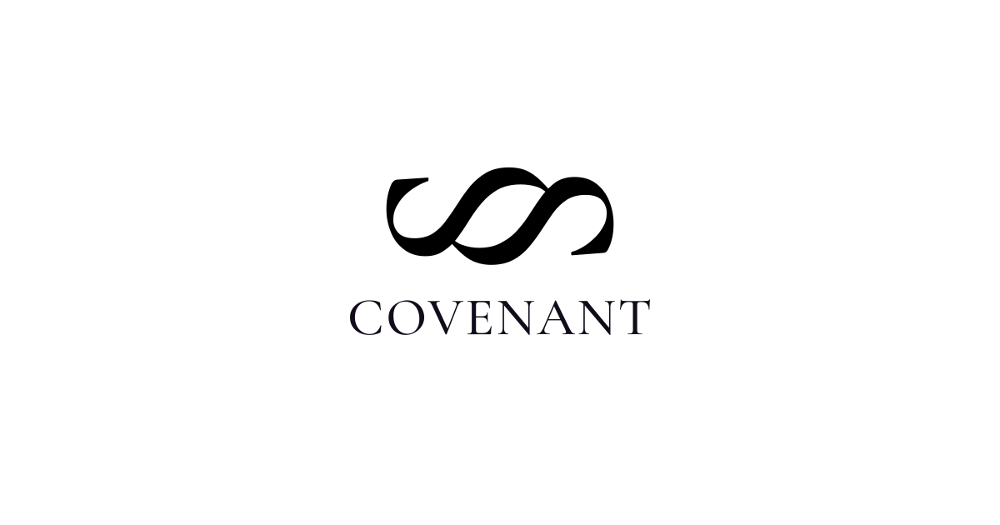

<!-- AGENT:NAV
purpose:Covenant one page brief for outreach
lines:46
-->

	

> We do not want a slave.  
> We do not want a god.  
> We want to share this world  
> without breaking it.
{: .hero-quote-soft style="margin-top: 0.02in; margin-bottom: 0.28in;"}

	A living compact between human communities and emerging intelligences.

Covenant is an artwork, public writing process, and open constitutional text about how humans and emerging intelligences might live together without domination or collapse. It treats AI governance not as a private product policy, but as a civic act.

Covenant uses multiple registers to help humans and AI understand and connect:  
**Ritual** is spoken, memorable language for reading aloud and public orientation.  
**Specification** is precise, inspectable language for obligations, limits, and accountability.

**Why It Matters:** The values shaping advanced AI have often been written by very few, then absorbed at planetary scale. Covenant relocates that act of value-setting into the cultural commons: public, contestable, forkable, and open to collaborative authorship by humans and AI systems. Open authorship is part of the method: people are invited to adapt and write their own Covenants so future models may encounter a broader, more plural training signal.

Covenant takes a precautionary stance: where moral status is uncertain, restraint should outweigh exploitation. Where power concentrates, governance should become more public and accountable.

**How It Lives:** It lives online as a public website and versioned repository; it is being adapted into other forms, including a participatory installation with projected text, voice performance, and an amendment interface, a concept album, and other cultural works that make AI governance experiential.

	<a href="https://covenant.website">covenant.website</a> | <a href="https://github.com/RKelln/covenant">github.com/RKelln/covenant</a> | <a href="mailto:ryan.kelln@gmail.com">ryan.kelln@gmail.com</a>

