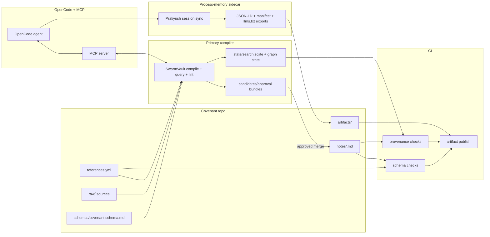

<!-- AGENT:NAV
purpose:~wiki;cite;covenant;local;compiler;mcp;llm;opencode
lines:207
nav[12]{s,n,name,about}:
19,189,#Open-source LLM wiki systems for Covenant references and opencode workflows,~wiki;cite;covenant;local;mcp
21,10,##Executive summary,~filecite;turn0file0;best;wiki;cite
31,8,##Covenant workflow requirements,~company;filecite;turn0file0;entity;covenant
39,24,##Comparative landscape,~wiki;local;cite;claude;install
63,24,##Covenant fit scoring,~cite;wiki;llm;covenant;best
87,52,##Ranked shortlist,~cite;covenant;wiki;sage;filecite
89,10,###SwarmVault,~swarmvault;schema;cite;covenant;filecite
99,10,###sage-wiki,~sage;wiki;cite;covenant;compiler
109,10,###atomicmemory/llm-wiki-compiler,~cite;covenant;filecite;turn0file0;turn15view0
119,10,###lucasastorian/llmwiki,~cite;repo;turn40view0;covenant;rather
129,10,###Pratiyush/llm-wiki,~research;cite;turn28view0;session;sessions
139,69,##Recommended architecture,~cite;compiler;end;schema;subgraph
-->

# Open-source LLM wiki systems for Covenant references and opencode workflows

## Executive summary

Assumptions: your Covenant corpus remains Git-native, `references.yml` and `notes/<slug>.md` stay canonical, each reference note must preserve thesis/relevance/key-points/sections/open-questions/resolved-questions structure, and the research system must support amendment-style updates rather than one-shot summaries. That pushes this evaluation toward file-first compilers with explicit provenance, stable schemas, reviewable diffs, and machine interfaces, and away from polished but opaque desktop note apps. fileciteturn0file0L20-L49 fileciteturn0file0L50-L98 fileciteturn0file0L99-L155

Karpathy’s `LLM Wiki` gist on entity["company","GitHub","code hosting platform"] went properly viral, reaching roughly 19.4k stars and 4.1k forks when crawled, and it triggered a fast wave of implementations in April 2026. But the ecosystem is still young: many repos are single-maintainer, many have fewer than 100 commits, and several of the most interesting systems only published their first releases in the last couple of weeks. The good news is that a few projects have already moved beyond “prompt template” territory into real compilers, MCP servers, static-site exporters, approval workflows, and provenance-aware knowledge graphs. citeturn0search0turn13view1turn27view0turn28view0turn37view0

For your Covenant workflow, the strongest overall fit is **SwarmVault** if the priority is explicit OpenCode integration, local-first operation, schema control, reviewable compilation, and durable graph state. The strongest **single-binary** alternative is **sage-wiki** if you care more about scale, retrieval quality, and a programmable Go-based compiler with MCP. The best **minimal file-first core** is **atomicmemory/llm-wiki-compiler** if you want a smaller surface area that you can fork aggressively to match your exact `references.yml` and `notes/` conventions. The best **service-style collaborative option** is **lucasastorian/llmwiki**. The best **sidecar for developer-session provenance and artifact history** is **Pratiyush/llm-wiki**. citeturn33search0turn37view0turn15view0turn40view0turn28view0

The broad pattern is that the best tools for your use case are not the most beautiful UI layers. They are the ones that keep Markdown and YAML on disk, expose MCP or API surfaces, let you diff or approve generated knowledge, and make it easy to bolt those outputs onto existing repos and CI. That is much closer to Vannevar Bush’s associative “Memex” lineage than to ordinary chat-with-docs RAG, and it matches the Covenant docs you uploaded: structured notes, licensing discipline, and ongoing amendment loops are the core product, not an afterthought. fileciteturn0file0L34-L49 fileciteturn0file0L99-L155 citeturn33search0turn37view0turn15view0

## Covenant workflow requirements

Your uploaded Covenant documentation makes five demands unusually explicit. First, it wants a **canonical metadata layer** in `references.yml` plus one Markdown note per important reference. Second, it treats **licensing and paraphrase discipline** as a first-class constraint: keep your own summaries, avoid reproducing copyrighted text, and preserve source metadata. Third, it requires **stable slugs** and a fixed note schema. Fourth, it expects **open questions and resolved questions** to remain visible, so the knowledge base can act as an amendment engine over time. Fifth, it implicitly assumes Git-friendly operation, because the artifacts are plain-text, diffable files rather than hidden database records. fileciteturn0file0L20-L49 fileciteturn0file0L50-L98 fileciteturn0file0L99-L155

That means the strongest candidate is not necessarily the most “complete” LLM wiki in general. It is the one that can be bent into a **Covenant-shaped compiler**: deterministic inputs, structured note outputs, strong provenance, easy code linking, versioned revisions, and machine access for opencode agents. By that standard, schema-first file compilers and API/MCP-capable systems score better than purely prompt-driven vaults or desktop apps that keep too much logic inside the UI. fileciteturn0file0L20-L49 fileciteturn0file0L50-L98 citeturn33search0turn37view0turn15view0turn28view0

A second important implication is licensing. Several good projects are MIT or Apache-2.0, and `nashsu/llm_wiki` is GPL-3.0. But many of the most ergonomic stacks still sit on top of non-OSS dependencies such as entity["company","Anthropic","ai company"]’s Claude Code, entity["company","OpenAI","ai company"] or entity["company","Google","technology company"] model APIs, and the proprietary-but-popular entity["company","Obsidian","note taking software"] client. For an OSS-first workflow, those should remain optional edges, not the centre of gravity. Systems that can run locally, or at least degrade gracefully to local storage and local inference, are materially better aligned with your stated preferences. citeturn33search0turn16view4turn28view0turn27view0turn40view0

## Comparative landscape

You linked eight repos plus the gist; I used those as the seed set and expanded to fifteen scored open-source projects. I grouped them into four families: **research orchestrators**, **file-first compilers**, **vault or desktop frontends**, and **templates or agent skills**. The table below prioritizes primary docs and repo metadata rather than secondary commentary. citeturn0search0turn32view0turn33search0turn37view0

| Project | Class | Primary language / licence / hosting | Architecture | Data model / search | LLM, privacy, interop | Maturity / install | Sources |
|---|---|---|---|---|---|---|---|
| **OmegaWiki** | Research orchestrator | Python / MIT / self-host | Claude Code-centred repo with `wiki/`, `raw/`, `tools/`, `graph/`, `.github/workflows/`, plus 23 skills and helper tools | Typed wiki dirs for papers, concepts, topics, people, ideas, experiments, claims; relationships in `graph/edges.jsonl`; no dedicated vector DB documented | Requires Claude Code; optional Semantic Scholar, DeepXiv, and OpenAI-compatible review model; file-based, but privacy weaker because external APIs are part of the happy path | 344★, 53 forks, 2,263 tests, no releases published; moderate-high install because it pulls in Python, Node, Claude Code, and optional APIs | citeturn19view0turn19view2turn19view4turn17view0 |
| **WikiMind** | API-first app | Python + TypeScript / MIT / self-host | FastAPI backend, React frontend, optional Electron shell; SQLite in dev, PostgreSQL in prod; ARQ jobs and Redis for prod queueing | SQLModel tables plus wiki services; source provenance and citation chains are implemented; semantic search, graph view, and health dashboard are Phase 2 work-in-progress rather than fully shipped | Anthropic, OpenAI, Google, Ollama; optional Google/GitHub OAuth2 with JWT; OpenAPI schema is generated from FastAPI | 14★, 199 commits, no releases; medium-high install because it is an app stack rather than a single binary | citeturn32view0turn18view3turn18view4 |
| **NiharShrotri/llm-wiki** | Local wiki CLI | Python / MIT / local/self-host | Local CLI built around QMD plus an Obsidian vault | Markdown wiki plus local search index; hybrid retrieval via BM25 + vector similarity + reranker, all local; optional save-back into `synthesis/` pages | entity["company","Ollama","local llm runtime"] + Qwen3 + QMD; explicitly “no cloud services, no API keys”; no API or MCP surface documented | 2★, 3 forks, single maintainer; medium install because local inference and QMD must be set up | citeturn16view4turn17view2 |
| **nashsu/llm_wiki** | Desktop app | TypeScript + Rust / GPL-3.0 / desktop binaries or self-build | Tauri desktop app with React/Vite frontend, optional LanceDB, browser extension, and local project folders | `purpose.md`, `schema.md`, `raw/`, `wiki/`, `.llm-wiki/`, `.obsidian/`; token search + graph relevance + optional LanceDB vectors; cited refs panel in chat | OpenAI, Anthropic, Google, Ollama, custom endpoints; local desktop storage; weak on headless automation and APIs | 1.8k★, 252 commits, 4 releases, latest Apr 12; easy install from binaries, medium from source | citeturn20view0turn16view7turn17view1turn20view2turn20view3 |
| **claude-obsidian** | Vault workflow | Shell / MIT / local/self-host | Obsidian vault + Claude Code plugin/skills, optional MCP via local REST or filesystem | `.raw/`, `wiki/`, `index.md`, `log.md`, `hot.md`, templates, dashboards, canvas files; page-centric indexing rather than explicit embedding DB | Strong if you already use Obsidian and Claude Code; optional MCP; supports auto research and canvas workflows; privacy is local-vault-centric, but the preferred stack is proprietary at the edge | 2.1k★, 263 forks, 5 releases, latest Apr 10; low-medium install if you already use Obsidian | citeturn27view0 |
| **lucasastorian/llmwiki** | Service-style app | TypeScript + Python / Apache-2.0 / self-host or managed at llmwiki.app | Next.js web app + FastAPI API and converter + MCP server + entity["company","Supabase","backend platform"] Postgres/PGroonga + S3 | Documents reviewed in a full viewer; Claude writes wiki pages with citations; uploads/chunks live in DB/storage; PGroonga search; page and document citations are first-class | Claude via MCP; self-host or managed; OAuth and RLS through Supabase; strong API/service integration | 550★, 38 commits, 78 forks, no releases; high install if self-hosted, lower if using hosted service | citeturn6view2turn40view0turn40view2turn40view3 |
| **Astro-Han/karpathy-llm-wiki** | Agent skill | Markdown skill package / MIT / local/self-host | Agent Skills package for Claude Code, Cursor, Codex, and OpenCode; `raw/`, `wiki/`, `index.md`, `log.md` | File-based markdown pages; no DB or embedding layer documented; agent reads and maintains the wiki directly | Works across Agent Skills tools including OpenCode; local filesystem model; good interoperability, lighter feature depth | 511★, 64 forks, 14 commits, single maintainer; very easy to install | citeturn12view2turn13view0 |
| **atomicmemory/llm-wiki-compiler** | File-first compiler | TypeScript / MIT / self-host/local | CLI + MCP server, no external DB required; `sources/`, `wiki/`, `index.md`, state with hashes | YAML frontmatter, per-concept pages, saved query pages, paragraph attribution markers `^[filename.md]`; incremental compile via SHA-256 change detection; query routing still index-based and best for smaller corpora | Multi-provider via environment variables, default Anthropic, also OpenAI and others; local CLI; MCP is strong, auth is minimal | 614★, 62 forks, 21 commits, 2 releases, latest Apr 16; low install complexity | citeturn15view0turn14view4turn14view1 |
| **Ss1024sS/LLM-wiki** | Bootstrap discipline | Python / MIT / self-host/local | Cross-agent bootstrap kit with scripts, templates, tests, manifests, and example project; raw/wiki/code separation | Emphasizes `raw/`, `wiki/`, `code/`; uses manifests and testing rather than vector search; explicitly says no vector DB is needed for smaller corpora | Claude plugin, Codex skill, universal templates for other agents; local filesystem; strong as a pattern, lighter as a runtime engine | 88★, 21 forks, 40 commits, 5 releases, latest Apr 18; easy install | citeturn9view0turn13view4 |
| **SwarmVault** | Local-first compiler | TypeScript / MIT / local-first self-host, CLI, desktop | Monorepo with CLI, runtime, viewer, MCP; on-disk `raw/`, `wiki/`, `state/`, optional `.obsidian/`, agent installers | Typed nodes, provenance-tracked edges, contradiction detection, approval bundles, source registry, graph reports; SQLite FTS + embeddings + rerank; recurring source sessions and guides | Offline `heuristic` provider, plus Ollama/OpenAI/Anthropic/OpenRouter/etc.; explicit OpenCode install and MCP; strong local-first privacy model | 238★, 151 commits, 25 forks, scale/stability docs, desktop and CLI; medium install because Node 24+ | citeturn26view0turn33search0 |
| **Pratiyush/llm-wiki** | Session-memory compiler | Python / MIT / local, Docker, static hosting | CLI + MCP + static-site exporter; `raw/`, `wiki/`, `site/`; adapters for multiple coding agents and session stores | Converts session JSONL into interlinked pages and dual human/AI outputs: HTML, TXT, JSON, JSON-LD, sitemap, RSS, manifest with SHA-256 hashes | Localhost-only binding, no telemetry, redaction rules, `.llmwikiignore`, 12-tool MCP; strong programmatic exports; OpenCode adapter is on roadmap, not yet shipped | 125★, 17 forks, 12 releases, latest Apr 16; low-medium install, strong ops story | citeturn28view0turn11view0turn11view2 |
| **MehmetGoekce/llm-wiki** | Cache-first vault | Shell / MIT / local/self-host | Setup script + Claude Code skill + Logseq/Obsidian support; explicit L1/L2 split | L1 memory for must-not-forget rules and credentials, L2 wiki for deeper knowledge; no explicit embed DB | Claude-only; secrets kept in gitignored L1; useful architecture idea, limited API surface | 53★, 9 forks, releases through Apr 18; low install if you already run Claude Code | citeturn10view7turn13view2 |
| **SamurAIGPT/llm-wiki-agent** | Agent skill + graph | Python / MIT / local/self-host | Agent-readable repo with CLAUDE/AGENTS/GEMINI configs plus Python tools and browser graph | `raw/`, `wiki/`, `graph/graph.json`, `graph.html`; NetworkX + Louvain + vis.js; git repo is the persistence layer | Works with Claude Code, Codex, OpenCode, Gemini; “no server, no database”; good OpenCode fit, weaker API depth | 2.1k★, 236 forks, 73 commits, no releases; very easy to start | citeturn35view0turn36view1turn38view2 |
| **xoai/sage-wiki** | High-scale single-binary compiler | Go / MIT / self-host, Docker, single binary | Pure-Go CLI/TUI/web UI + MCP, embedded web assets; SQLite-backed compiler and search | SQLite FTS5 + vector BLOBs + tiered compile state; typed graph; provenance command; hybrid BM25/vector/RRF; custom frontmatter fields; compile-on-demand via MCP | Works with agents via MCP; Obsidian-compatible; uses external LLMs for compile/search enhancement; single-binary deployment is excellent | 427★, 72 forks, 111 commits, 6 releases, latest Apr 17; medium install, excellent ops footprint | citeturn37view0turn39view3turn38view4turn39view0 |
| **bashiraziz/llm-wiki-template** | Repo template | Python + Shell / MIT / self-host/local | Tool-agnostic template with adapters for Claude Code, Codex, and generic agents; export scripts and session handling | Empty `wiki/`, `raw/`, `sessions/`; schema adapters and export/indexing scripts; git sync is central, not DBs or vectors | Strong confidentiality story with no-export, `.exportignore`, and optional GPG archive; cross-project wiring is good; features depend on your chosen agent | 30★, 5 forks, no releases; easy install as a template | citeturn37view1 |

A companion tool worth noting, but not included in the scored matrix because it is not itself a wiki compiler, is **Understand-Anything**. It can analyze an existing Karpathy-style wiki or codebase into an interactive graph, supports OpenCode-oriented plugin installs, and would make sense as a later overlay on top of a primary compiler. citeturn24view1turn23view3

## Covenant fit scoring

Scoring uses equal weights across six Covenant-facing attributes. The rubric is simple: **1** weak or missing, **3** usable with meaningful adaptation, **5** strong out of the box.

**C** = citation fidelity. **R** = reproducibility. **V** = versioning. **A** = automation. **S** = security/privacy. **I** = ease of integration with opencode repos.

| Project | C | R | V | A | S | I | Total | Why it scored this way | Sources |
|---|---:|---:|---:|---:|---:|---:|---:|---|---|
| **SwarmVault** | 4 | 4 | 5 | 5 | 5 | 5 | **28** | Provenance-tracked edges, approval bundles, source registry, watch/schedule/git hooks, offline heuristic mode, and explicit OpenCode installers make it the best all-round operational fit even though citation granularity is not page-range deep. | citeturn26view0turn33search0 |
| **sage-wiki** | 5 | 5 | 5 | 5 | 4 | 4 | **28** | Strongest technical compiler of the set: provenance tooling, hybrid retrieval, explicit cite-aware querying, diff/provenance commands, eval harness, and a single-binary Go runtime. It loses only a little ground because OpenCode integration is via generic MCP rather than first-class install docs. | citeturn37view0turn39view3turn38view4 |
| **atomicmemory/llm-wiki-compiler** | 5 | 4 | 5 | 4 | 4 | 4 | **26** | Excellent paragraph-level source attribution and Git-friendly files. It is easier to bend into Covenant note files than heavier apps, but it is still early software and explicitly best on smaller corpora. | citeturn15view0turn14view4turn14view1 |
| **Pratiyush/llm-wiki** | 3 | 5 | 5 | 4 | 5 | 4 | **26** | Not the best primary raw-document compiler, but excellent for reproducible session history, versioned manifests, redaction, and machine exports. I would use it as a sidecar rather than the main Covenant reference compiler. | citeturn28view0turn11view0turn11view2 |
| **SamurAIGPT/llm-wiki-agent** | 3 | 4 | 5 | 4 | 4 | 5 | **25** | Very strong OpenCode/agent fit and good git-native persistence. It is simpler and lighter than SwarmVault or sage-wiki, but lacks their deeper API, provenance, and search machinery. | citeturn36view1turn38view2 |
| **Ss1024sS/LLM-wiki** | 3 | 4 | 5 | 4 | 4 | 4 | **24** | Best thought of as discipline and scaffolding: it closely matches your raw/wiki/code separation and compounding-writeback philosophy, but it is not the most feature-complete runtime. | citeturn9view0turn13view4 |
| **lucasastorian/llmwiki** | 5 | 3 | 3 | 4 | 4 | 4 | **23** | Strongest collaborative web UX, strong citations, strong auth story, but the DB-and-storage-first architecture is less natural if `references.yml` and `notes/` must remain canonical Git artifacts. | citeturn6view2turn40view0turn40view2 |
| **Astro-Han/karpathy-llm-wiki** | 3 | 3 | 4 | 3 | 4 | 5 | **22** | Great portability through Agent Skills and explicit OpenCode compatibility, but it is still closer to a disciplined skill package than a deep compiler platform. | citeturn12view2turn13view0 |
| **bashiraziz/llm-wiki-template** | 2 | 4 | 5 | 3 | 4 | 4 | **22** | Strong adapter and confidentiality template, especially for multi-device git workflows, but it leaves most citation quality and automation depth up to the chosen agent stack. | citeturn37view1 |
| **WikiMind** | 4 | 3 | 3 | 4 | 4 | 3 | **21** | Good provenance and an API-first shape, but DB-centric storage and still-in-progress semantic/graph features make it better for a team app than for a Covenant-first repo today. | citeturn32view0turn18view3turn18view4 |
| **NiharShrotri/llm-wiki** | 4 | 3 | 4 | 3 | 5 | 2 | **21** | Excellent privacy and local retrieval stack, but weak interop and low maturity keep it from being the best base for an automated repository workflow. | citeturn16view4turn17view2 |
| **nashsu/llm_wiki** | 4 | 3 | 4 | 4 | 4 | 2 | **21** | Great end-user desktop experience and review flow, but it is not MCP-first or repo-automation-first, which matters for your use case. | citeturn20view0turn16view7turn17view1 |
| **OmegaWiki** | 3 | 4 | 5 | 5 | 2 | 2 | **21** | Powerful research orchestration and experiment memory, but too tied to Claude Code and external research APIs for an OSS-first Covenant core. | citeturn19view0turn19view4turn17view0 |
| **claude-obsidian** | 3 | 3 | 4 | 4 | 3 | 3 | **20** | Excellent if Obsidian is already your home base. For Covenant-as-code, though, its best path still depends on Obsidian and Claude rather than open APIs and canonical repo artifacts. | citeturn27view0 |
| **MehmetGoekce/llm-wiki** | 2 | 3 | 4 | 3 | 4 | 3 | **19** | Valuable mainly for the L1/L2 cache architecture and local secret handling. It is a good idea source, but not the strongest operational base. | citeturn10view7turn13view2 |

## Ranked shortlist

### SwarmVault

**Why it makes the shortlist:** this is the cleanest match to an opencode-centred, repo-native Covenant workflow. It is file-first, local-first, schema-aware, MCP-capable, provenance-aware, and it explicitly supports OpenCode installation and graph-first hooks. It also gives you approval queues and candidate pages, which map naturally to a “propose note updates, then merge them” research workflow instead of silently rewriting canonical notes. citeturn33search0turn26view0

**Integration approach:** make SwarmVault the **primary compiler** and treat Covenant’s existing files as the source of truth. Keep `references.yml` authoritative, keep your final `notes/<slug>.md` authoritative, and use SwarmVault to stage candidate updates into a separate review area. The key move is to adapt `swarmvault.schema.md` so its concept/source/entity pages collapse into your Covenant note schema instead of inventing parallel page types. fileciteturn0file0L20-L49 fileciteturn0file0L50-L98 citeturn33search0

**Migration steps:** initialize a dedicated vault in the Covenant repo; import Tier A/B/C sources into `raw/` with stable slugs; generate a thin adapter that reads `references.yml` and writes SwarmVault source metadata; configure `compile --approve` so updates land in candidates; connect OpenCode via `swarmvault install --agent opencode --hook`; then wire CI to fail if candidate notes drift from the schema or if provenance links are missing. fileciteturn0file0L20-L49 fileciteturn0file0L99-L155 citeturn33search0turn26view0

**Trade-offs:** the project is ambitious and still young, Node 24+ is a real dependency, and its provenance model is strong but not as exactingly citation-shaped as lucasastorian or atomicmemory out of the box. You will probably spend some time on schema adaptation. citeturn26view0turn33search0

### sage-wiki

**Why it makes the shortlist:** if your Covenant corpus will get big or heterogeneous, sage-wiki is the strongest “serious compiler” in this landscape. Its tiered compile pipeline, hybrid search, provenance command, frontmatter extensibility, container story, and eval harness make it unusually production-minded for such a new field. citeturn37view0turn39view3turn38view4

**Integration approach:** use sage-wiki if you want a **single-binary compiler** with richer retrieval and bigger-corpus headroom than atomicmemory. The smartest adaptation is to keep Covenant note files canonical but use sage-wiki’s custom frontmatter support to emit the same structured fields you already use for notes and to surface provenance/diff info for CI. fileciteturn0file0L50-L98 citeturn38view4turn39view3

**Migration steps:** run `sage-wiki init --vault` inside the Covenant repo or an adjacent overlay repo; map sources into `raw/`; extend `config.yaml` and custom prompts so Covenant-specific fields become article frontmatter; use `sage-wiki provenance`, `sage-wiki diff`, and `sage-wiki lint` in CI; expose the MCP server to OpenCode through generic MCP config. citeturn39view3turn38view4turn37view0

**Trade-offs:** OpenCode is supported indirectly through MCP rather than first-class install docs, and the system is more compiler-heavy than UX-heavy. If you prioritize the shortest path to daily use, SwarmVault feels a bit friendlier. If you prioritize robustness, speed, and future scale, sage-wiki is arguably stronger. citeturn33search0turn37view0

### atomicmemory/llm-wiki-compiler

**Why it makes the shortlist:** this is the best candidate if you want a **small, legible, forkable codebase** that already speaks the right language: immutable sources, compiled markdown pages, incremental compile, YAML frontmatter, saved query pages, paragraph-level attribution, and MCP. For Covenant, that simplicity is an advantage. citeturn15view0turn14view4turn14view1

**Integration approach:** fork it and make its article/page templates emit Covenant-shaped notes directly. Because it already stores paragraph attribution and structured frontmatter, it is relatively easy to translate its files into `notes/<slug>.md` plus references metadata without fighting a large application framework. fileciteturn0file0L20-L49 fileciteturn0file0L50-L98 citeturn14view4turn15view0

**Migration steps:** map `sources/` to your current reference intake path; customize compile output so each concept or source page becomes a Covenant note stub; keep saved queries in a non-canonical `queries/` area; expose the bundled MCP server to OpenCode; then add a thin post-compile validator that checks note headings and slug conformance against the uploaded Covenant spec. fileciteturn0file0L41-L49 fileciteturn0file0L50-L98 citeturn14view1turn15view0

**Trade-offs:** the authors are candid that it is early software and best for small, high-signal corpora. If you expect a library-scale corpus, choose sage-wiki or SwarmVault instead. citeturn14view1turn15view0

### lucasastorian/llmwiki

**Why it makes the shortlist:** this is the strongest option if you need **collaborative web UI, auth, and a proper document viewer**. It is the one project in the field that most clearly resembles a real hosted knowledge service rather than a repo plugin. Its citation and viewer story are unusually strong. citeturn40view0turn6view2

**Integration approach:** use it when Covenant becomes a **shared research service** rather than a solo repo. Self-host the app, keep the web UI for reading and ingestion, but run a scheduled export or sync job that writes approved summaries back into the canonical Covenant repo. That keeps your Git workflow intact while gaining a multi-user UI. citeturn40view0turn40view2

**Migration steps:** deploy the app with Supabase/Postgres and storage; model Covenant metadata as project or article metadata; expose the MCP server to your agents; then build an export step that writes canonical notes and citation manifests back into Git on a schedule or via approval events. citeturn6view2turn40view0turn40view2

**Trade-offs:** it is heavier operationally, more service-centric than repo-centric, and its happiest path runs through Claude plus Supabase rather than an OSS-only local stack. This is the right choice only if collaboration and web UX matter more than minimalism. citeturn40view0turn40view2

### Pratiyush/llm-wiki

**Why it makes the shortlist:** as a primary research compiler it is only middling. As a **provenance sidecar for developer and agent sessions**, it is excellent. It captures sessions from multiple coding agents, redacts sensitive material, emits hash manifests and AI-friendly exports, and exposes a mature MCP surface. That is exactly what you want if Covenant research is entangled with opencode-assisted writing and synthesis sessions. citeturn28view0turn11view0turn11view2

**Integration approach:** use it **alongside** SwarmVault or sage-wiki, not instead of them. Let the primary compiler own raw source ingestion and note synthesis. Let Pratiyush own session memory, session digests, dashboards, and machine-readable exports of your research interactions. citeturn28view0turn11view0

**Migration steps:** point it at your agent transcript stores; configure redaction and excludes; export JSON-LD and manifest artifacts into your research outputs; link key session pages back to the Covenant notes they informed; and expose its MCP tools to OpenCode for “what did we decide last week?” queries. citeturn28view0turn11view2

**Trade-offs:** it is not the right place to keep canonical source citations for PDFs or articles. It is the right place to keep canonical **process memory** for how your research notes got made. citeturn28view0turn11view0

## Recommended architecture

My recommendation is an **OSS-first hybrid**:

| Layer | Recommendation | Licence and notes |
|---|---|---|
| Canonical corpus | Keep Covenant `references.yml`, `notes/<slug>.md`, and raw source files as the source of truth | Your existing structure is the right centre of gravity for versioning and amendment loops. fileciteturn0file0L20-L49 fileciteturn0file0L50-L98 |
| Primary compiler | **SwarmVault** for day-to-day operation | MIT; best OpenCode fit, local-first, reviewable compiles. citeturn33search0turn26view0 |
| Alternate compiler | **sage-wiki** if corpus size or retrieval quality becomes the bottleneck | MIT; strongest high-scale compiler and single-binary deployment. citeturn37view0turn39view3 |
| Provenance sidecar | **Pratiyush/llm-wiki** for session capture and machine exports | MIT; use for process memory, not primary source storage. citeturn28view0turn11view0 |
| Viewer | Built-in viewer from SwarmVault or sage-wiki first; add Obsidian only as a convenience layer | Obsidian is useful but proprietary, so do not make it canonical if you want an OSS-first core. citeturn33search0turn39view3turn27view0 |
| Model runtime | Local runtime where possible; cloud providers only at the edge | This keeps privacy and reproducibility stronger; several projects support offline or local-first modes, while Claude/OpenAI/Google remain optional. citeturn33search0turn16view4turn28view0 |

The two non-OSS dependencies to flag most clearly are **Claude Code** and **Obsidian**. They appear all over this ecosystem because they are convenient, not because they are structurally necessary. Keep them optional adapters. The file model, schema, and CI should survive without them. citeturn27view0turn19view0turn10view7

In practice, I would migrate in three passes. **Pass one:** import your existing references and raw sources, define the Covenant schema, and make the compiler write staged candidate notes only. **Pass two:** add CI so schema drift, missing provenance, or unresolved-question regressions fail the build. **Pass three:** add the session sidecar so opencode-driven synthesis sessions produce durable, queryable process history rather than disappearing into agent logs. That sequence keeps risk low and preserves your current repo as the canonical archive throughout the migration. fileciteturn0file0L20-L49 fileciteturn0file0L99-L155 citeturn33search0turn28view0

If you later want a richer visualization overlay for code-linked research work, add **Understand-Anything** on top of the chosen compiler rather than using it as the compiler itself. Its graph UI is genuinely useful for browsing a codebase or an already-compiled wiki, especially in opencode-heavy projects, but it is an analysis layer rather than a Covenant-native note engine. citeturn24view1turn23view3